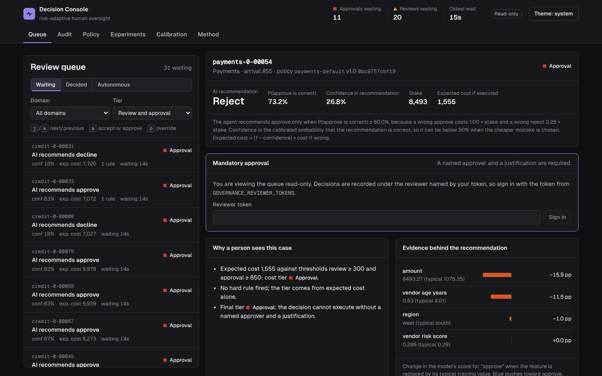
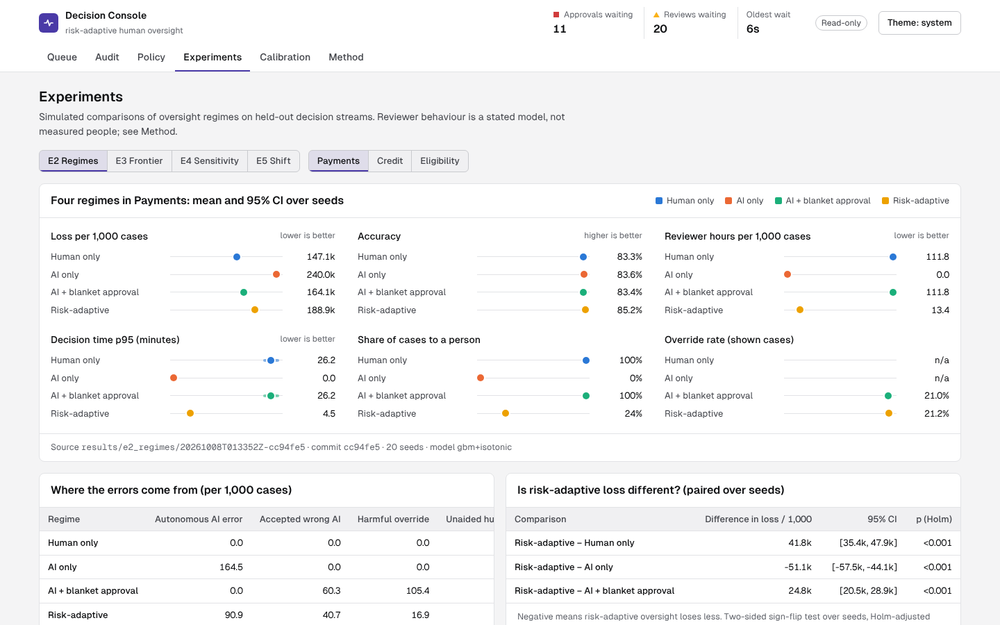

# human-ai-decision-governance

**When should a person check an AI decision?** This framework puts every AI decision through the same steps: calibrated confidence, then expected cost if the decision is wrong, then a versioned, auditable policy that routes it to one of three tiers. Low risk executes on its own, medium risk goes to a reviewer, and high risk needs a named person's approval with a written justification. A simulation harness compares this risk-adaptive regime with human only, AI only and AI with blanket approval on three decision domains. A review console runs the live queue, with every decision recorded in a hash-chained audit log.



> **What has and has not been run.** Every number here comes from executed code, copied from [research/generated/results.md](research/generated/results.md). The reviewers in the experiments are **simulated** with stated parameters (accuracy by case difficulty, deference to the AI, handling time, fatigue). The results are consequences of that model, tested for sensitivity, not measurements of people. **No study with human participants has been run** (*Status: pending*). Trust is measured only through proxies such as override rate and automation bias.

## Key findings

From 20 seeds per regime on synthetic payments, UCI Adult (eligibility) and UCI German Credit. Full write-up: [research/REPORT.md](research/REPORT.md).

| Finding | Evidence |
|---|---|
| Risk-adaptive oversight is a workload trade-off, not a free lunch | Payments loss per 1,000 cases: AI only 240k, risk-adaptive 189k, blanket approval 164k, human only 147k. Risk-adaptive uses 13.4 reviewer hours per 1,000 cases against 111.8 for human only |
| It gets the most out of each reviewer hour | 3,810 units of loss avoided per reviewer hour, against 831 for human only and 679 for blanket approval |
| Routing on expected cost beats the obvious alternatives at the same workload | At 20% review share in payments: −23.3k vs random audit, −17.2k vs confidence-only routing (Holm p < 0.001) |
| Calibration mattered little for routing here | Uncalibrated expected cost routes as well (payments, p = 0.43); post-hoc calibration helped ECE only on credit (Platt −2.09 pp) |
| Adding people can hurt when the model is better than they are | Eligibility: human only loses 439 per 1,000 vs 165 for AI only; risk-adaptive ties AI only (166) |
| The payments result is stable; the eligibility result is not | Across reviewer settings, risk-adaptive beats AI only on payments by 39.3k–74.6k. On eligibility it flips sign with reviewer accuracy on hard cases and deference |
| Under covariate shift the router moves work to people on its own | Decided autonomously falls from 76.7% to 51.2%; ECE stays ≤ 2.7 pp |
| Oversight is uneven across groups | Credit applicants under 25 have a higher error rate (45.3% vs 39.1%) but get less human attention (17.5% vs 24.1%), because their loans are smaller |



## Quickstart

Requirements: Python ≥ 3.11 with [uv](https://docs.astral.sh/uv/), Node ≥ 20.

```bash
git clone https://github.com/rockys-stash/human-ai-decision-governance
cd human-ai-decision-governance
make setup          # uv sync + npm ci
make test           # 29 unit and API tests
cp .env.example .env
# add a reviewer to .env, e.g. GOVERNANCE_REVIEWER_TOKENS=alice:<a token of 16+ characters>
make serve          # builds the console, serves it with the API on http://127.0.0.1:8000
```

The committed results in `results/` render immediately, and an empty queue database is seeded with 200 cases per domain on first start. Without reviewer tokens the console is read-only.

To re-run every experiment and regenerate the tables and figures:

```bash
make experiments    # E1-E5, then `governance report`. Measured runtimes add up to about 31 minutes (E4 alone 16)
```

`make help` lists every target. Without make: `uv run governance --help`.

## How it works

```
Case ─► Agent decision (Bayes cost threshold) ─► Calibrated confidence ─► Expected cost ─► Policy ─► Tier
                                                                                              │
         ┌──────────────────────────────┬──────────────────────────────────┬────────────────┘
      autonomous                      review                       mandatory approval
   executes, logged          reviewer accepts or overrides   named approver + justification
                                   (reason required)            (override also possible)
                    every routing decision and human action ─► hash-chained audit log
```

| Component | What it does | Code |
|---|---|---|
| Domains | Credit (German Credit, 5:1 costs × amount), eligibility (Adult, unit stakes, 3:1 costs), payments (synthetic with known true probability) | `src/governance/data`, [dataset card](data/DATASET.md) |
| Agent | Gradient boosting or logistic regression; acts on the cost threshold, so confidence is P(the chosen action is correct) | `src/governance/agent` |
| Confidence | Platt or isotonic calibration on a held-out split; ECE, MCE, Brier, NLL | `src/governance/confidence` |
| Policy | Versioned YAML: two expected-cost thresholds plus hard rules that can only raise a tier; a content hash goes into every routing record | `src/governance/policy`, `configs/policies` |
| Reviewer model | Accuracy by case difficulty, mode-dependent deference, log-normal handling time, fatigue, a staffed priority queue | `src/governance/humans` |
| Regimes | Human only, AI only, AI + blanket approval, risk-adaptive; common random numbers across regimes | `src/governance/regimes` |
| Experiments | YAML configs, seeds, bootstrap CIs and paired sign-flip tests over seeds, versioned run directories | `src/governance/experiments`, `configs/` |
| API + console | FastAPI service with SQLite queue and audit log; React/TypeScript "decision console" | `src/governance/api`, `web/` |

An example policy (`configs/policies/payments.yaml`):

```yaml
thresholds:
  review: 300       # expected cost of executing the AI decision
  approval: 850
rules:
  - id: large-payment
    route: approval
    when: [{field: stake, op: gte, value: 20000}]
  - id: changed-bank-details
    route: review
    when: [{field: "feature:new_bank_details", op: eq, value: 1}]
```

## Experiments

| | Question | Config |
|---|---|---|
| E1 | Is the agent's confidence calibrated, and does post-hoc calibration help? | `configs/e1_calibration.yaml` |
| E2 | How do the four regimes trade off loss, accuracy, workload, time and oversight behaviour? | `configs/e2_regimes.yaml` |
| E3 | What makes routing work: expected cost vs random audit, confidence only, stake only, uncalibrated? | `configs/e3_frontier.yaml` |
| E4 | How sensitive is the ranking to deference, hard-case accuracy, review speed and staffing? | `configs/e4_sensitivity.yaml` |
| E5 | What happens under covariate and concept shift? | `configs/e5_shift.yaml` |

Each run writes `results/<experiment>/<UTC timestamp>-<commit>/` with the config, per-seed metrics, a summary and the environment. Metric definitions are in [docs/METRICS.md](docs/METRICS.md).

## The console

| View | What it shows |
|---|---|
| Queue | Live review and approval queue, ordered by expected cost; case inspector with the AI recommendation, confidence, why the case was routed, and feature evidence; accept, approve or override with a reason. Keyboard: `j`/`k`, `a`, `o` |
| Audit | Every routing decision and human action, filterable, with one-click chain verification |
| Policy | Thresholds and rules per domain, the policy hash, and the policy's operating point on the measured workload–loss frontier |
| Experiments | E2–E5 with intervals, error attribution, paired tests and table views of every chart |
| Calibration | E1 reliability diagrams and calibration metrics |
| Method | The reviewer model's assumptions, the metrics, limitations and the pending human study |

Light and dark themes, mobile layouts, keyboard navigation, and no axe-core violations (WCAG 2.1 AA) on any view. More screenshots are in [docs/screenshots](docs/screenshots).

## Repository layout

```
configs/            experiment configs and policies
data/               dataset card and pinned raw files (CC BY 4.0)
docs/               PLAN, DESIGN, DECISIONS, METRICS, REVIEW, screenshots
research/           REPORT.md, generated tables and figures
results/            committed experiment runs
scripts/            reproduce.sh
src/governance/     the package
tests/              unit, API and browser tests
web/                the console (React, TypeScript, Vite)
```

## Development

```bash
make lint           # ruff, mypy, ESLint, tsc
make test           # unit and API tests
make test-ui        # 25 browser and accessibility tests (Playwright + Chromium)
make screenshots    # re-capture docs/screenshots
```

CI runs lint, types, the tests, a check that the report tables regenerate byte-identical from the committed results (figures are regenerated but not compared, because their layout depends on installed fonts), the frontend build, and the browser tests.

## Security

- Reviewer identity comes from the token presented (`X-Reviewer-Token`), never from the request body. Tokens are configured as `name:token` pairs, must be at least 16 characters and are compared in constant time. With none configured, decisions are disabled.
- Reads and writes are rate limited per client. Responses carry a strict Content-Security-Policy and framing protection.
- The audit log is tamper-evident, not tamper-proof: someone with write access to the database file could rewrite the whole chain.
- No secrets are committed; configuration comes from the environment (`.env.example`).

The console is built for local or trusted-network use. See [docs/REVIEW.md](docs/REVIEW.md) for the full security review.

## Limitations

- Reviewers are simulated. They judge against the realised outcome, so they may know things the features do not show, which favours human-only regimes in payments.
- Costs for eligibility and payments are assumptions, and they set the decision threshold.
- The headline payments result depends on reviewers deferring less in mandatory approval than in review. E4 varies that.
- Credit has 200 test cases per seed, too few to separate regimes.
- The modelled concept shift is mild.

## Documentation

[Plan](docs/PLAN.md) · [Design](docs/DESIGN.md) · [Decisions](docs/DECISIONS.md) · [Metrics](docs/METRICS.md) · [Review board](docs/REVIEW.md) · [Dataset card](data/DATASET.md) · [Report](research/REPORT.md)

## License and citation

MIT, see [LICENSE](LICENSE). The UCI datasets are CC BY 4.0. Citation metadata is in [CITATION.cff](CITATION.cff).
