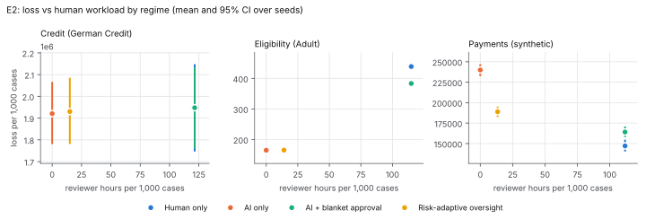
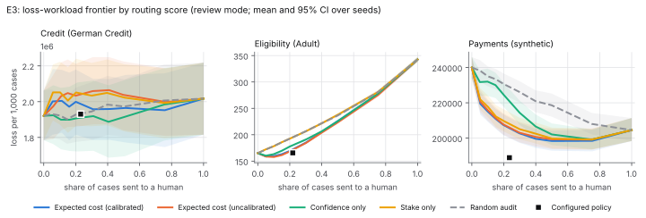
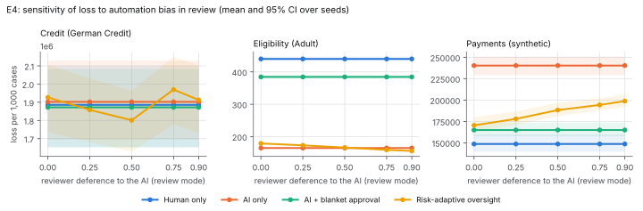
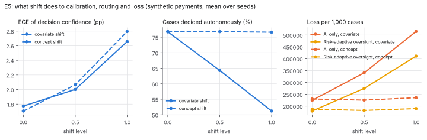

# When should a person decide? Risk-adaptive oversight of AI decisions in simulation

**Status of evidence.** Every number below is copied from `research/generated/results.md`, which
`governance report` writes from the `summary.json` of the latest run of each experiment (run ids and
commits are listed there). Reviewers are **simulated** with stated parameters; no study with real
people has been run (**Status: pending**, §8). Read the results as consequences of the reviewer
model, tested for sensitivity in E4, not as measurements of human behaviour.

## 1. Question

An AI agent makes a decision. Should it execute on its own, wait for a person to review it, or
require a named person's approval? We compare four oversight regimes on three decision domains:

| Regime | What a person does |
|---|---|
| Human only | Decides every case without seeing the AI |
| AI only | Nothing; every AI decision executes |
| AI + blanket approval | Approves or overrides every AI decision |
| Risk-adaptive | Reviews medium-risk and approves high-risk decisions; low-risk ones execute |

Risk-adaptive routing works in four steps (`docs/DESIGN.md`, `src/governance/policy`):

1. The agent (gradient boosting, `gbm`) picks the action with the Bayes cost threshold.
2. A calibrator fitted on a held-out split gives the probability the action is correct.
3. Expected cost = (1 − confidence) × cost if wrong.
4. A versioned YAML policy maps expected cost to a tier, and hard rules can only raise it.

## 2. Setup

- **Domains** (`data/DATASET.md`):
  - Credit approval on UCI German Credit: 1,000 rows, with the dataset's own 5:1 cost matrix scaled by amount.
  - Eligibility screening on UCI Adult: 48,842 rows, unit stakes, an assumed 3:1 cost of a wrong denial.
  - Synthetic payment approvals: known true probability; a missed fraud loses the amount and a wrong rejection costs 25% of it.
- **Splits:** per seed, 60/20/20 train, calibration and test. The test split is replayed as an arrival stream (30 cases/hour, 4 reviewers).
- **Policy thresholds** were set on tuning seeds 100–104. The reported seeds start at 20261008.
- **Simulated reviewer** (`src/governance/humans/reviewer.py`):
  - Judges a case correctly with probability falling linearly from 0.95 (easy) to 0.65 (hardest). Reviewing someone else's decision costs a further 0.05 of accuracy.
  - Difficulty comes from an independent reference model (the true probability for payments).
  - Defers to the AI without judging with probability 0.5 in review and 0.2 in mandatory approval.
  - Takes 2/6/6 median minutes for review/approval/unaided decisions.
  - Loses up to 5 points of accuracy to fatigue during continuous work.
- **Statistics:** each seed refits everything and redraws reviewer behaviour, so seeds are the unit of resampling.
  - Means are reported with 95% bootstrap CIs over seeds.
  - Paired regime comparisons use a two-sided sign-flip test, Holm-adjusted within each domain and metric.
  - E2, E3 and E5 use 20 seeds; E4 uses 10 per setting.
- **Loss:** cost of wrong final decisions per 1,000 cases, in the domain's stake units. It is the primary outcome because the costs are asymmetric. Accuracy is reported but is not the target.

## 3. Results

### RQ1: Is the agent's confidence calibrated? (E1)

| Domain (gbm) | ECE uncalibrated | ECE Platt | ECE isotonic |
|---|---|---|---|
| Credit | 10.8 pp [10.0, 11.6] | 8.7 [8.1, 9.2] | 9.7 [8.8, 10.7] |
| Eligibility | 0.9 [0.8, 1.0] | 1.0 [0.9, 1.1] | 0.9 [0.8, 1.0] |
| Payments | 1.6 [1.5, 1.8] | 1.6 [1.4, 1.7] | 1.8 [1.6, 2.0] |

- **H1 (post-hoc calibration lowers ECE) is mostly not supported.** On the two larger domains, the boosted model's raw scores are already well calibrated (ECE ≤ 1.8 pp), and calibration changes ECE by at most 0.16 pp. Isotonic regression slightly *worsens* Brier score there (+0.0001 to +0.0004, p ≤ 0.001).
- Only on the small credit domain does Platt scaling help: −2.09 pp ECE [−2.98, −1.22]. Credit ECE stays near 9–11 pp, partly because 15 bins over 200 test cases are noisy.
- Against the known true probability (payments), logistic regression is closer than boosting: mean absolute error 0.009 vs 0.021. Both are close to the irreducible Brier score (0.0962 and 0.0970 vs 0.0960).
- These pairwise E1 tests are *not* multiplicity-adjusted (24 tests). Isotonic was fixed as the default calibrator before E1 ran. Given these results, Platt or no calibration would have been as good or better; the regime results below use isotonic as planned.

### RQ2: How do the four regimes trade off loss and workload? (E2)



**Payments (synthetic).** Loss per 1,000, reviewer hours per 1,000 and p95 decision time:

| Regime | Loss / 1,000 | Reviewer h / 1,000 | p95 decision time (min) |
|---|---|---|---|
| Human only | 147k [141k, 154k] | 111.8 | 26.2 |
| Blanket approval | 164k [159k, 170k] | 111.8 | 26.2 |
| Risk-adaptive | 189k [184k, 194k] | 13.4 | 4.5 |
| AI only | 240k [234k, 246k] | 0 | 0 |

- No regime dominates. Risk-adaptive oversight cuts AI-only loss by 51k per 1,000 (21%, p < 0.001 Holm) with 12% of human-only reviewer hours. It avoids 3,810 units of loss per reviewer hour, against 831 for human only and 679 for blanket approval.
- Its absolute loss is higher than human only (+41.8k) and blanket approval (+24.8k), both p < 0.001.
- **Eligibility (Adult).** The model is more accurate than the simulated reviewers (84.9% vs 81.3%), so adding people hurts:
  - Human only and blanket approval lose 439 and 383 per 1,000, against 165 for AI only.
  - Risk-adaptive ties AI only on loss (166 vs 165, p = 0.655) while raising accuracy by 2.4 pp. The extra correct decisions are mostly cheap ones, so loss does not move.
- **Credit (German Credit).** With 200 test cases per seed and stakes up to 18,424 DM, every loss CI spans about ±10%. No pair of regimes differs significantly on loss (all Holm p = 1.0).
  - Accuracy differs: human only 78.6%, AI only 56.3%. The cost-weighted agent declines many good applicants on purpose, because a bad loan costs 5×.
- **H2 is partly supported.**
  - AI only has the most high-stake errors in credit and payments (42.5 and 24.2 per 1,000).
  - Human only and blanket approval are the slowest: p95 26–31 minutes, against 4.5–5.1 for risk-adaptive.
  - Risk-adaptive loss is within blanket approval's CI in credit, below it in eligibility, and above it in payments.

### RQ3: What makes routing work? (E3)

At a matched 20% review share (each router's threshold set on the calibration split), the table gives calibrated expected cost minus each alternative, in loss per 1,000 (Holm-adjusted):

| Alternative router | Payments | Eligibility | Credit |
|---|---|---|---|
| Random audit | −23.3k (p < 0.001) | −23.3 (p < 0.001) | +71k (p = 0.71) |
| Confidence only | −17.2k (p < 0.001) | −8.3 (p < 0.001) | +91k (p = 0.71) |
| Stake only | −2.2k (p = 0.018) | −23.2 (p < 0.001)¹ | −52k (p = 0.67) |
| Expected cost, uncalibrated | −0.3k (p = 0.43) | +0.9 (p = 0.011) | −34k (p = 0.71) |

¹ Eligibility has unit stakes, so stake-only routing is random audit (ties broken at random).

- **H3 is supported for random audit and confidence-only routing** on the two larger domains. Routing on expected cost, not confidence alone, is what makes oversight pay off.
- **H3 is not supported for calibration.** Uncalibrated scores route as well as calibrated ones (payments) or slightly better (eligibility, +0.9 per 1,000).
- Credit shows nothing at this sample size.
- **Approval vs review (payments).** The configured policy sends 23.5% of payments to a person and loses 189k. Review-only routing by expected cost loses 207.4k at 20% and 202.7k at 30%, so about 206k at the same workload. The difference comes from mandatory approval, where the simulated reviewer defers less (0.2 vs 0.5). That is an assumption, and E4 varies it.
- **Review everything (payments).** Sending 100% of payments to review (204.5k) is worse than sending 75% (198.4k), because reviewers sometimes accept wrong AI decisions and sometimes override right ones.



### RQ4: When does risk-adaptive oversight lose its advantage? (E4, E5)

One reviewer parameter varies at a time, 10 seeds each.

- **Payments, stable.** The loss order human only < blanket < risk-adaptive < AI only holds at every setting. Risk-adaptive beats AI only by 39.3k to 74.6k per 1,000 (p ≤ 0.001 throughout).
- **Eligibility, depends on the reviewers.** Risk-adaptive versus AI only flips sign:
  - It loses when reviewers judge independently: +14 at deference 0, +17 at hard-case accuracy 0.55.
  - It wins when reviewers are better on hard cases: −15 at 0.75, −32 at 0.85.
  - It also wins when they defer more: −6 at 0.75, −9 at 0.9.
  - In this domain oversight only helps if the people on hard cases are at least as good as the model there.
- **Credit, mostly noise.** Human only has the lowest mean loss once hard-case accuracy reaches 0.75. Elsewhere the differences are within noise.
- **Staffing.** Doubling reviewers to 8 lowers human-only loss (payments 149k → 124k) only through less fatigue, the model's sole staffing-to-accuracy path. Review speed changes hours, not accuracy.



**Shift (E5, payments).** The agent, calibrator and policy were fitted before the shift.

| Covariate shift | 0 | 0.5 | 1 |
|---|---|---|---|
| AI accuracy | 84.0% | 78.7% | 73.4% |
| ECE | 1.8 pp | 2.0 | 2.7 |
| Decided autonomously (risk-adaptive) | 76.7% | 64.3% | 51.2% |
| Reviewer h / 1,000 (risk-adaptive) | 12.7 | 21.3 | 32.2 |
| Loss: AI only / risk-adaptive / human only | 225k / 180k / 136k | 341k / 275k / 239k | 515k / 411k / 391k |

- Calibration held up under covariate shift (ECE ≤ 2.7 pp). The router therefore moved work to people on its own as cases became riskier, and the gap between risk-adaptive and human-only loss narrowed (from 43k to 20k).
- The concept shift we modelled is mild: changed bank details become more predictive of fraud. It touches about 6% of payments, raises ECE from 1.7 to 2.8 pp and barely moves loss. We report it as a weak test, not as evidence of robustness to concept shift.



## 4. Error analysis (E2, risk-adaptive regime)

- **Where errors come from.** Per 1,000 payments: 90.9 autonomous AI errors, 40.7 accepted wrong AI decisions and 16.9 harmful overrides.
  - In eligibility, accepted wrong AI decisions (59.3) outnumber autonomous errors (49.3). Reviewers there accept a wrong AI decision in 58.6% of the cases where the AI was wrong (automation bias), against 42.7% under blanket approval.
  - Routed cases are the hard ones, so deference is more likely to land on an AI error.
- **Errors by tier.** The tiers sort difficulty as intended: final error rate is 11.9% autonomous vs 25.7% review vs 20.2% approval (payments), and 6.3% / 36.8% / 31.1% (eligibility).
- **Groups (error analysis only; groups are not routing inputs).**
  - *Eligibility:* men have a 15.8% final error rate and 28.7% of their cases go to a person; women have 6.4% and 8.2%. The difference follows the label base rates: more men are near the income threshold.
  - *Credit:* applicants under 25 have a higher final error rate (45.3% vs 39.1%) but get *less* human attention (17.5% vs 24.1%). Their loans are smaller, so expected cost and the `large-exposure` rule route them less. This is a direct consequence of routing on stake, and it is the kind of disparity a deployment should monitor.

## 5. What the evidence supports

1. Routing on calibrated expected cost beats random audit and confidence-only routing at the same human workload, where the data are large enough to tell (payments, eligibility).
2. Risk-adaptive oversight is a workload trade-off, not a free lunch. In payments it recovers 55% of the loss gap between AI only and human only with 12% of the hours. In eligibility it adds nothing unless reviewers beat the model on hard cases.
3. Mandatory approval only helps if people defer less there than in review. The headline payments policy depends on that assumption.
4. Post-hoc calibration mattered little for routing here. The boosted model was already calibrated on the larger domains.

## 6. Threats to validity

- **Simulated reviewers.**
  - Reviewers are judged against the *realised* outcome with accuracy set by case difficulty, so they can know things the features do not show (for example, calling a vendor). This is why human-only loss is lowest in payments. A reviewer limited to the model's information would be weaker. That variant was not run.
  - Deference, accuracy, fatigue and speed are round-number assumptions, not estimates.
- **Costs.** Eligibility and payment costs are assumptions. Changing them changes the decision threshold, the routing and the ranking.
- **Small credit sample.** Credit conclusions are underpowered.
- **One model family per run.** Regimes use gbm + isotonic. E1 shows other choices calibrate as well or better.
- **Thresholds.** Policy thresholds were tuned once on separate seeds. A deployment would retune them per domain and review them over time.

## 7. Reproduction

```bash
uv sync && npm --prefix web ci
scripts/reproduce.sh          # E1-E5 then `governance report`
```

The measured runtimes (single-threaded, run side by side on 4 cores) were 504 s (E1), 126 s (E2), 161 s (E3), 946 s (E4) and 123 s (E5).

## 8. Pending

- **Human study (Status: pending).** Trust and reliance are measured only by proxy (override rate and precision, automation bias, appropriate reliance) in simulation. The console's review queue records real reviewer decisions with identities, reasons and timestamps in a hash-chained log, so it can serve as the instrument for a study. No participants have been recruited and no human data exist in this repository.
- A reviewer variant limited to the model's information, and concept shifts that affect most cases, were not run.
